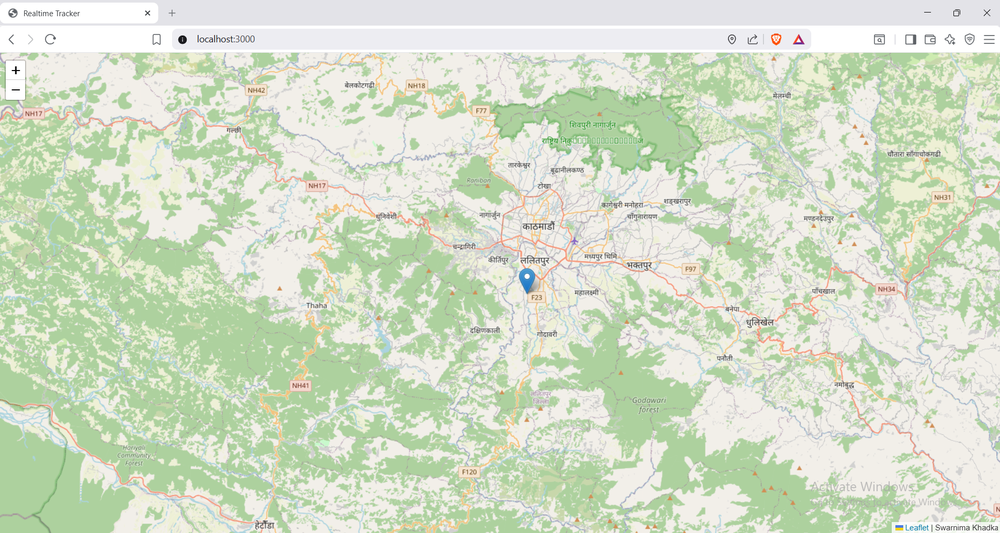
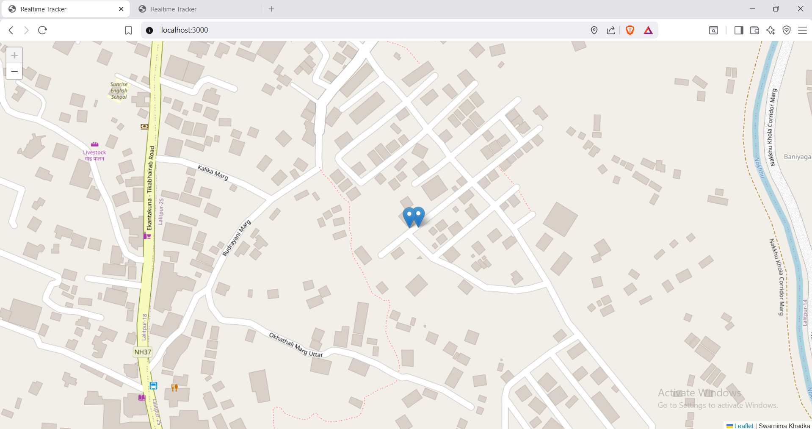

# Realtime Tracker

A simple real-time location tracking application built with Node.js, Express, Socket.IO, EJS, and Leaflet. Connected users can share their live location and view updates on an interactive map.

## Features

- Live location tracking
- Real-time updates with Socket.IO
- Interactive map using Leaflet
- Express server with EJS
- Client-side geolocation streaming

## Tech Stack

- Node.js
- Express
- Socket.IO
- EJS
- Leaflet
- OpenStreetMap

## Installation

### Clone the repository

```bash
git clone <your-repository-url>
cd <repository-name>
```

### Install dependencies

```bash
npm install
```

### Run the project

```bash
node app.js
```

Open `http://localhost:3000` in your browser and allow location access when prompted.

## Screenshots

| Map View | Multiple Users |
|----------|----------------|
|  |  |

## Notes

- Geolocation works best on `localhost` or over HTTPS.
- Each connected user is displayed with a live marker.
- Map tiles are provided by OpenStreetMap.

## License

This project is for learning purposes.
